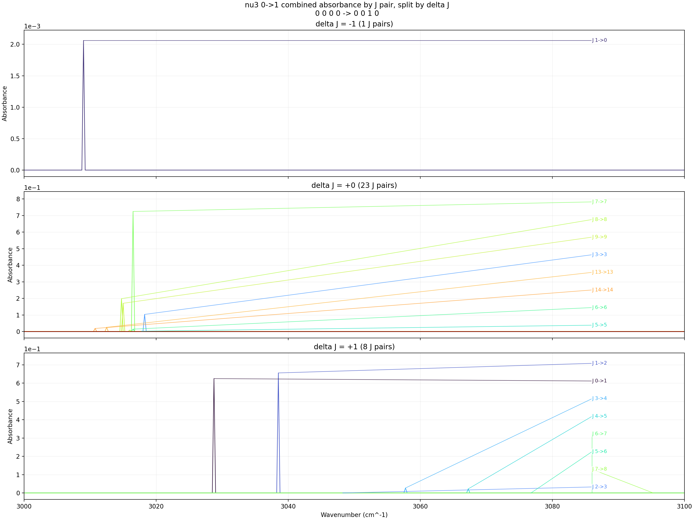

# Combined Pure nu3 Absorbance Progressions

- ExoMol input folder: not used
- HITRAN input folder: `F:\GitHub\hapi\ch4_nu3_progressions\band_line_texts`
- HITRAN source table schema: `CH4_M6_I1`
- Wavenumber window: `3000` to `3100 cm^-1` with `step = 0.25 cm^-1`
- Y axis: `absorbance`
- Progression family: pure `nu3` only with `n1 = n2 = n4 = 0`
- J-pair source priority: `HITRAN`
- Pressure: `3 Torr`
- Mole fraction: `0.008`
- Path length: `100 cm`
- ExoMol broadening cutoff: `0.5 cm^-1`
- ExoMol minimum line intensity kept: `0.000e+00 cm/molecule`
- HITRAN intensity threshold: `1.000e-23`
- On-figure labels: strongest `8` J pairs per `delta J` panel, plus forced labels for `J 2->3, J 3->4` when present
- HTML traces are decimated to at most `5000` points per J pair for responsiveness
- Summary CSV: [progression_summary.csv](progression_summary.csv)

## nu3 0->1

- Modes: `0 0 0 0 -> 0 0 1 0`
- Selected J-pair curves: `32`
- Selected from HITRAN: `32`
- Selected from ExoMol: `0`
- Grid points per curve: `401`
- Plotted branch counts: `delta J=-1: 1`, `delta J=0: 23`, `delta J=+1: 8`
- Skipped J pairs outside plotted branches: `0`
- Labeled J pairs by branch: `dJ_-1: J 1->0; dJ_+0: J 5->5, J 6->6, J 14->14, J 13->13, J 3->3, J 9->9, J 8->8, J 7->7; dJ_+1: J 2->3, J 7->8, J 5->6, J 6->7, J 4->5, J 3->4, J 0->1, J 1->2`
- Outputs: [PNG](nu3_0_to_1_absorbance.png), [HTML](nu3_0_to_1_absorbance.html), [J-pair CSV](nu3_0_to_1_jpairs.csv)

