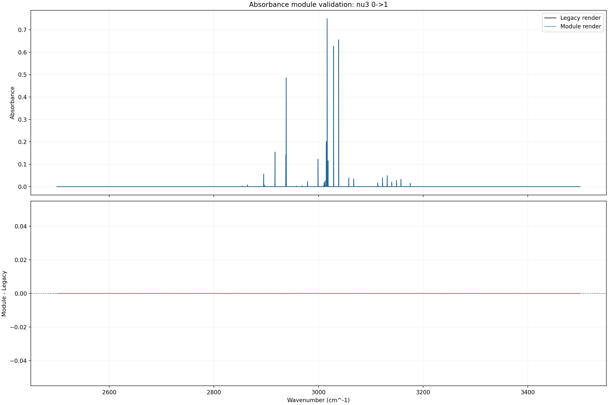
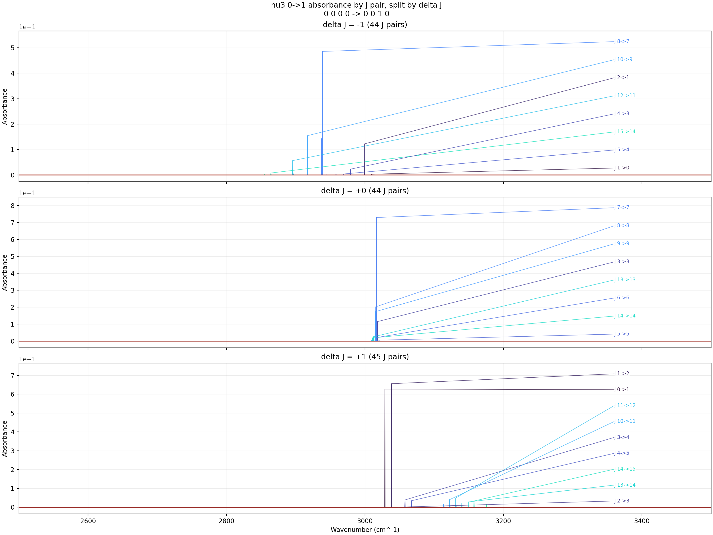
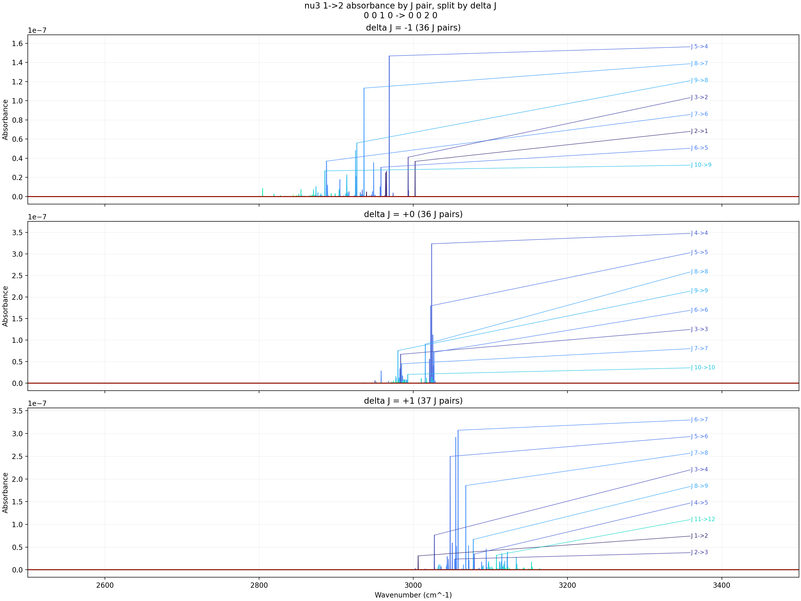
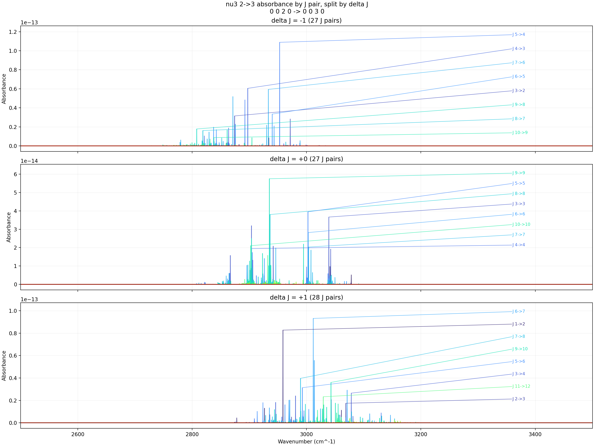
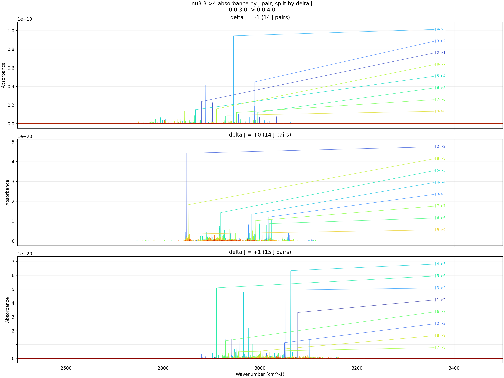

# ExoMol Sorted nu3 Absorbance Progressions

- Input folder: `F:\GitHub\hapi\exomol_ch4_mm_pure_nu3_band_texts_hitran_style_2500_3500_sorted`
- Wavenumber window: `2500` to `3500 cm^-1` with `step = 0.25 cm^-1`
- Y axis: `absorbance`
- Curve grouping: full J pair `(lower J, upper J)`, split into `delta J = -1, 0, +1` panels
- Line intensities come from the sorted `T296.0K` ExoMol exports, so this workflow keeps `T = 296 K`
- Pressure: `3 Torr`
- Mole fraction: `0.008`
- Path length: `100 cm`
- Broadening cutoff: `0.5 cm^-1`
- Minimum line intensity kept: `0.000e+00 cm/molecule`
- On-figure labels: strongest `8` J pairs per `delta J` panel, plus forced labels for `J 2->3, J 3->4` when present
- HTML traces are decimated to at most `5000` points per J pair for responsiveness
- Summary CSV: [progression_summary.csv](progression_summary.csv)

## Validation

- Validation report: [validation/validation_nu3_0_to_1.md](validation/validation_nu3_0_to_1.md)
- Validation HTML: [validation/validation_nu3_0_to_1.html](validation/validation_nu3_0_to_1.html)
- Max absolute difference: `0.000000000000e+00`
- Mean absolute difference: `0.000000000000e+00`
- Max relative difference: `0.000000000000e+00`
- Peak wavenumber delta: `0.000000e+00 cm^-1`

## nu3 0->1

- Modes: `0 0 0 0 -> 0 0 1 0`
- Files merged: `5`
- Lines kept after filtering: `55558`
- J-pair curves: `133`
- Grid points per curve: `4001`
- Plotted branch counts: `delta J=-1: 44`, `delta J=0: 44`, `delta J=+1: 45`
- Skipped J pairs outside plotted branches: `0`
- Labeled J pairs by branch: `dJ_-1: J 1->0, J 5->4, J 15->14, J 4->3, J 12->11, J 2->1, J 10->9, J 8->7; dJ_+0: J 5->5, J 14->14, J 6->6, J 13->13, J 3->3, J 9->9, J 8->8, J 7->7; dJ_+1: J 2->3, J 13->14, J 14->15, J 4->5, J 3->4, J 10->11, J 11->12, J 0->1, J 1->2`
- Outputs: [PNG](nu3_0_to_1_absorbance.png), [HTML](nu3_0_to_1_absorbance.html), [J-pair CSV](nu3_0_to_1_jpairs.csv)

## nu3 1->2

- Modes: `0 0 1 0 -> 0 0 2 0`
- Files merged: `5`
- Lines kept after filtering: `435094`
- J-pair curves: `109`
- Grid points per curve: `4001`
- Plotted branch counts: `delta J=-1: 36`, `delta J=0: 36`, `delta J=+1: 37`
- Skipped J pairs outside plotted branches: `0`
- Labeled J pairs by branch: `dJ_-1: J 10->9, J 6->5, J 2->1, J 7->6, J 3->2, J 9->8, J 8->7, J 5->4; dJ_+0: J 10->10, J 7->7, J 3->3, J 6->6, J 9->9, J 8->8, J 5->5, J 4->4; dJ_+1: J 2->3, J 1->2, J 11->12, J 4->5, J 8->9, J 3->4, J 7->8, J 5->6, J 6->7`
- Outputs: [PNG](nu3_1_to_2_absorbance.png), [HTML](nu3_1_to_2_absorbance.html), [J-pair CSV](nu3_1_to_2_jpairs.csv)

## nu3 2->3

- Modes: `0 0 2 0 -> 0 0 3 0`
- Files merged: `5`
- Lines kept after filtering: `2084100`
- J-pair curves: `82`
- Grid points per curve: `4001`
- Plotted branch counts: `delta J=-1: 27`, `delta J=0: 27`, `delta J=+1: 28`
- Skipped J pairs outside plotted branches: `0`
- Labeled J pairs by branch: `dJ_-1: J 10->9, J 8->7, J 9->8, J 3->2, J 6->5, J 7->6, J 4->3, J 5->4; dJ_+0: J 4->4, J 7->7, J 10->10, J 6->6, J 3->3, J 8->8, J 5->5, J 9->9; dJ_+1: J 2->3, J 11->12, J 3->4, J 5->6, J 9->10, J 7->8, J 1->2, J 6->7`
- Outputs: [PNG](nu3_2_to_3_absorbance.png), [HTML](nu3_2_to_3_absorbance.html), [J-pair CSV](nu3_2_to_3_jpairs.csv)

## nu3 3->4

- Modes: `0 0 3 0 -> 0 0 4 0`
- Files merged: `5`
- Lines kept after filtering: `868246`
- J-pair curves: `43`
- Grid points per curve: `4001`
- Plotted branch counts: `delta J=-1: 14`, `delta J=0: 14`, `delta J=+1: 15`
- Skipped J pairs outside plotted branches: `0`
- Labeled J pairs by branch: `dJ_-1: J 9->8, J 7->6, J 6->5, J 5->4, J 8->7, J 2->1, J 3->2, J 4->3; dJ_+0: J 9->9, J 6->6, J 7->7, J 3->3, J 4->4, J 5->5, J 8->8, J 2->2; dJ_+1: J 7->8, J 8->9, J 2->3, J 6->7, J 1->2, J 3->4, J 5->6, J 4->5`
- Outputs: [PNG](nu3_3_to_4_absorbance.png), [HTML](nu3_3_to_4_absorbance.html), [J-pair CSV](nu3_3_to_4_jpairs.csv)

