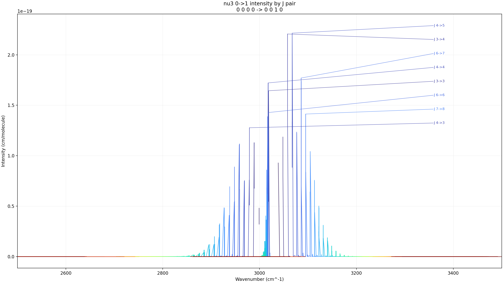
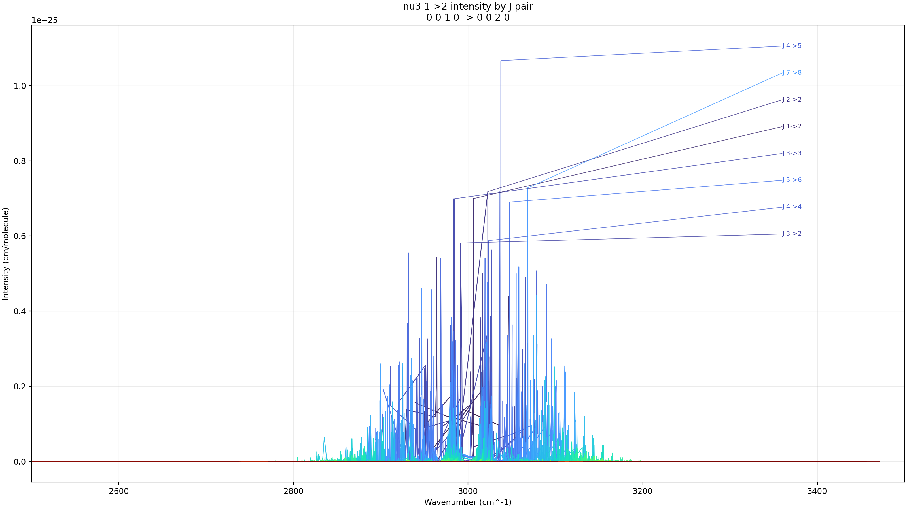
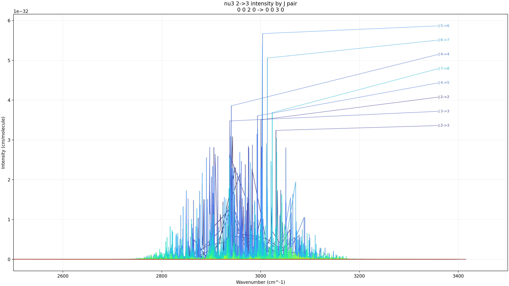
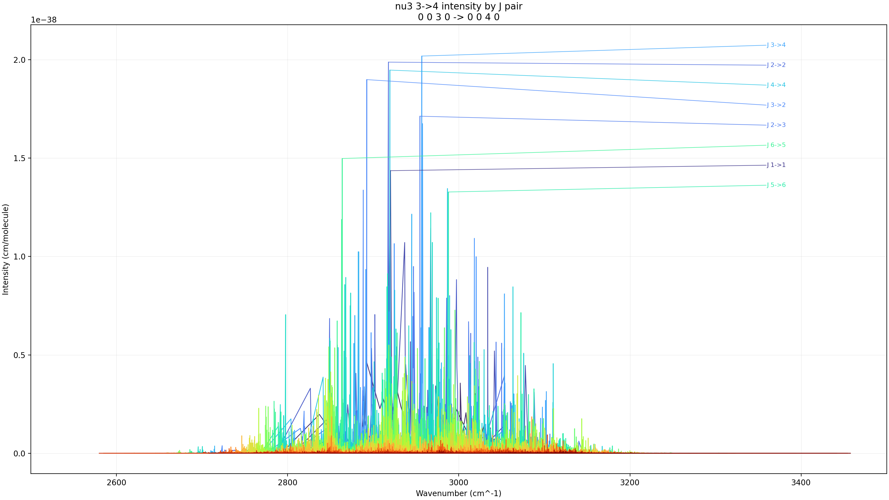

# ExoMol Sorted nu3 Intensity Progressions

- Input folder: `F:\GitHub\hapi\exomol_ch4_mm_pure_nu3_band_texts_hitran_style_2500_3500_sorted`
- Wavenumber window: `2500` to `3500 cm^-1`
- Y axis: `line_intensity_cm_per_molecule`
- Curve grouping: full J pair `(lower J, upper J)`
- On-figure labels: strongest `8` J pairs per progression
- Summary CSV: [progression_summary.csv](progression_summary.csv)

## nu3 0->1

- Modes: `0 0 0 0 -> 0 0 1 0`
- Files merged: `5`
- Rows plotted: `55558`
- J-pair curves: `133`
- Labeled J pairs: `J 4->3, J 7->8, J 6->6, J 3->3, J 4->4, J 6->7, J 3->4, J 4->5`
- Outputs: [PNG](nu3_0_to_1_intensity.png), [HTML](nu3_0_to_1_intensity.html), [J-pair CSV](nu3_0_to_1_jpairs.csv)

## nu3 1->2

- Modes: `0 0 1 0 -> 0 0 2 0`
- Files merged: `5`
- Rows plotted: `435094`
- J-pair curves: `109`
- Labeled J pairs: `J 3->2, J 4->4, J 5->6, J 3->3, J 1->2, J 2->2, J 7->8, J 4->5`
- Outputs: [PNG](nu3_1_to_2_intensity.png), [HTML](nu3_1_to_2_intensity.html), [J-pair CSV](nu3_1_to_2_jpairs.csv)

## nu3 2->3

- Modes: `0 0 2 0 -> 0 0 3 0`
- Files merged: `5`
- Rows plotted: `2084100`
- J-pair curves: `82`
- Labeled J pairs: `J 2->3, J 3->3, J 2->2, J 4->5, J 7->8, J 4->4, J 6->7, J 5->6`
- Outputs: [PNG](nu3_2_to_3_intensity.png), [HTML](nu3_2_to_3_intensity.html), [J-pair CSV](nu3_2_to_3_jpairs.csv)

## nu3 3->4

- Modes: `0 0 3 0 -> 0 0 4 0`
- Files merged: `5`
- Rows plotted: `868246`
- J-pair curves: `43`
- Labeled J pairs: `J 5->6, J 1->1, J 6->5, J 2->3, J 3->2, J 4->4, J 2->2, J 3->4`
- Outputs: [PNG](nu3_3_to_4_intensity.png), [HTML](nu3_3_to_4_intensity.html), [J-pair CSV](nu3_3_to_4_jpairs.csv)

