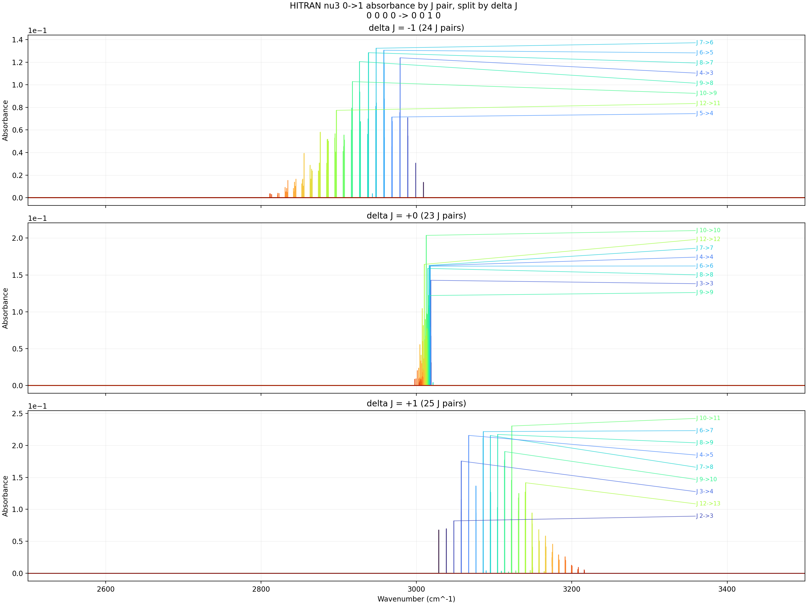

# HITRAN Band Text Absorbance Progressions

- Input folder: `F:\GitHub\hapi\ch4_nu3_progressions\band_line_texts`
- Source table schema: `CH4_M6_I1`
- Isolated runtime DB: `F:\GitHub\hapi\artifacts\hitran_band_text_absorbance\_runtime_db`
- Wavenumber window: `2500` to `3500 cm^-1` with `step = 0.01 cm^-1`
- Y axis: `absorbance`
- Curve grouping: full J pair `(lower J, upper J)`
- Temperature: `600 K`
- Pressure: `3 Torr`
- Mole fraction: `0.008`
- Path length: `100 cm`
- HAPI intensity threshold: `1.000e-23`
- On-figure labels: strongest `8` J pairs per progression, plus forced labels for `J 2->3` and `J 3->4` when present
- Summary CSV: [progression_summary.csv](progression_summary.csv)

## nu3 0->1

- Modes: `0 0 0 0 -> 0 0 1 0`
- Files merged: `1`
- HITRAN rows used: `6489`
- J-pair curves: `72`
- Grid points per curve: `100001`
- Labeled J pairs: `J 2->3, J 3->4, J 9->10, J 10->10, J 7->8, J 4->5, J 8->9, J 6->7, J 10->11`
- Outputs: [PNG](nu3_0_to_1_absorbance.png), [HTML](nu3_0_to_1_absorbance.html), [J-pair CSV](nu3_0_to_1_jpairs.csv)

## nu3 0->1

- Modes: `0 0 0 1 -> 0 0 1 1`
- Files merged: `4`
- HITRAN rows used: `3062`
- J-pair curves: `50`
- Grid points per curve: `100001`
- Labeled J pairs: `J 3->4, J 2->3, J 6->7, J 7->7, J 8->9, J 5->6, J 5->5, J 7->8, J 10->11, J 7->6`
- Outputs: [PNG](nu3_0_to_1_absorbance.png), [HTML](nu3_0_to_1_absorbance.html), [J-pair CSV](nu3_0_to_1_jpairs.csv)

## nu3 0->1

- Modes: `0 1 0 0 -> 0 1 1 0`
- Files merged: `2`
- HITRAN rows used: `2061`
- J-pair curves: `49`
- Grid points per curve: `100001`
- Labeled J pairs: `J 2->3, J 3->4, J 8->8, J 7->7, J 9->10, J 4->5, J 8->9, J 5->6, J 6->7, J 7->8`
- Outputs: [PNG](nu3_0_to_1_absorbance.png), [HTML](nu3_0_to_1_absorbance.html), [J-pair CSV](nu3_0_to_1_jpairs.csv)

