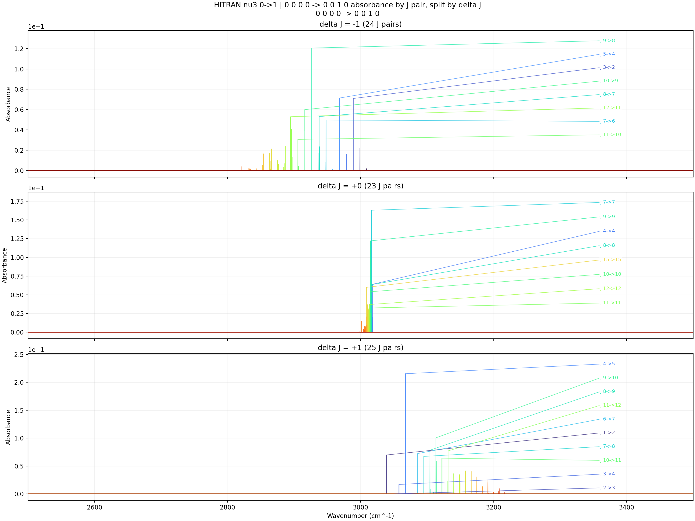

# HITRAN Band Text Absorbance Progressions

- Input folder: `D:\Github\hapi\ch4_nu3_progressions\band_line_texts`
- Source table schema: `CH4_M6_I1`
- Isolated runtime DB: `D:\Github\hapi\artifacts\hitran_band_text_absorbance_cmp_T600K_P3Torr_x0p008_L100cm_step0p1_nu3_0to1\_runtime_db`
- Wavenumber window: `2500` to `3500 cm^-1` with `step = 0.1 cm^-1`
- Y axis: `absorbance`
- Curve grouping: full J pair `(lower J, upper J)`, split into `delta J = -1, 0, +1` panels
- Temperature: `600 K`
- Pressure: `3 Torr`
- Mole fraction: `0.008`
- Path length: `100 cm`
- HAPI intensity threshold: `1.000e-23`
- On-figure labels: strongest `8` J pairs per `delta J` panel, plus forced labels for `J 2->3, J 3->4` when present
- Summary CSV: [progression_summary.csv](progression_summary.csv)

## nu3 0->1 | 0 0 0 0 -> 0 0 1 0

- Modes: `0 0 0 0 -> 0 0 1 0`
- Files merged: `1`
- HITRAN rows used: `6489`
- J-pair curves: `72`
- Grid points per curve: `10001`
- Plotted branch counts: `delta J=-1: 24`, `delta J=0: 23`, `delta J=+1: 25`
- Skipped J pairs outside plotted branches: `0`
- Labeled J pairs by branch: `dJ_-1: J 11->10, J 7->6, J 12->11, J 8->7, J 10->9, J 3->2, J 5->4, J 9->8; dJ_+0: J 11->11, J 12->12, J 10->10, J 15->15, J 8->8, J 4->4, J 9->9, J 7->7; dJ_+1: J 2->3, J 3->4, J 10->11, J 7->8, J 1->2, J 6->7, J 11->12, J 8->9, J 9->10, J 4->5`
- Outputs: [PNG](nu3_0_to_1__0_0_0_0_to_0_0_1_0_absorbance.png), [HTML](nu3_0_to_1__0_0_0_0_to_0_0_1_0_absorbance.html), [J-pair CSV](nu3_0_to_1__0_0_0_0_to_0_0_1_0_jpairs.csv)

