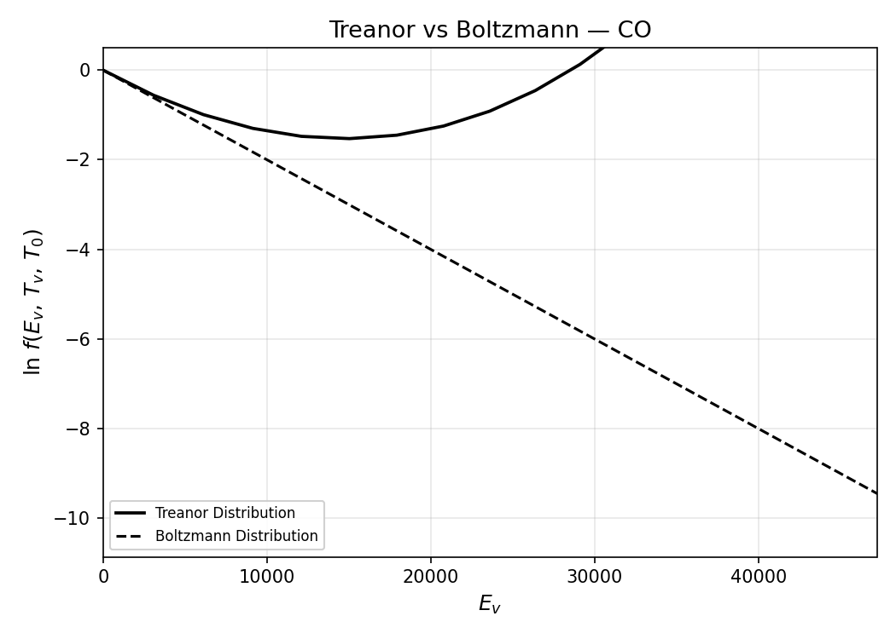
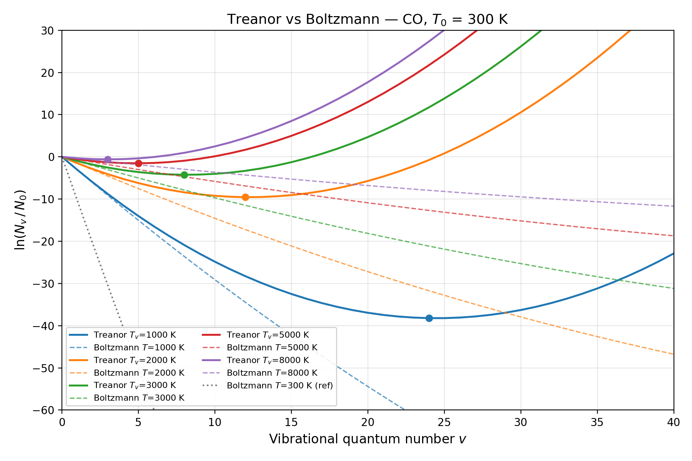
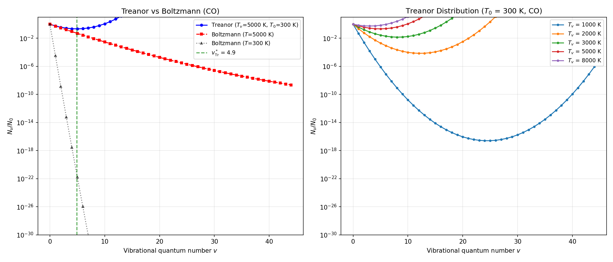

# Treanor Distribution Notes

This note explains the Treanor distribution as implemented in [`research/treanor.py`](../research/treanor.py) and the associated plotting scripts in `scripts/`.

## Physical context

In thermal equilibrium, vibrational populations follow the Boltzmann distribution at a single temperature $T$. But in vibrationally excited gases — particularly plasmas and shock-heated flows — energy exchange between vibrational modes (V-V exchange) can be much faster than energy transfer from vibration to translation (V-T relaxation). When V-V exchange dominates, the vibrational populations settle into a **non-equilibrium** steady state described by two temperatures:

- $T_v$: the **vibrational temperature**, governing the population of the first excited state relative to the ground state
- $T_0$: the **translational (gas) temperature**, governing the anharmonic correction at higher quantum numbers

The Treanor distribution captures this two-temperature regime. It was derived by Treanor, Rich, and Rehm (1968) and is presented in compact form by Fridman (2008).

## What the two temperatures do **not** mean

The two-temperature Treanor model does **not** mean there are only two vibrational states, and it does **not** assign one temperature to each vibrational level.

- The vibrational ladder still has many levels: $v = 0, 1, 2, 3, \dots$
- $N_v$ means the population of the specific level with quantum number $v$
- $N_v / N_0$ means the population of level $v$ relative to the ground state
- $T_v$ and $T_0$ are **global parameters** that shape the entire curve of populations across all $v$

So for example:

- $N_1 / N_0$ is the population ratio for the $v=1$ level
- $N_2 / N_0$ is the population ratio for the $v=2$ level

These are generally **not the same**. They are two different points on the same Treanor curve.

In this repo's implementation, the function

```python
treanor(v, Tv, T0, mol)
```

takes one value of `Tv` and one value of `T0`, then evaluates the population ratio for whatever vibrational level or array of levels you pass in as `v`.

So the model is:

- **many vibrational states** $v$
- **one vibrational temperature** $T_v$ for the whole distribution
- **one translational temperature** $T_0$ for the whole distribution

That is why it is called a **two-temperature** model: two temperatures control one full non-equilibrium population distribution over many states.

## The formula

For an anharmonic diatomic oscillator with harmonic frequency $\omega_e$ and anharmonicity constant $\omega_e x_e$, the vibrational energy of level $v$ is:

$$E_v = hc \left[\omega_e\, v - \omega_e x_e\, v(v+1)\right]$$

The Treanor distribution gives the population ratio $N_v / N_0$ as:

$$\ln\!\left(\frac{N_v}{N_0}\right) = -\frac{\theta_v\, v}{T_v} + \frac{x_e\, \theta_v\, v^2}{T_0}$$

where $\theta_v = (hc/k_B)\,\omega_e$ is the characteristic vibrational temperature and $x_e = \omega_e x_e / \omega_e$ is the anharmonicity parameter. This is Fridman Eq. (3-37) in the compact $v^2$ form.

### Why this is the same as Fridman Eq. (3-37)

Fridman writes the distribution in the form

$$f(v,T_v,T_0)=B\exp\!\left(-\frac{\hbar\omega v}{T_v}+\frac{x_e\hbar\omega v^2}{T_0}\right)$$

This matches the form above after three notation changes:

1. **Use a ground-state population ratio.**  
   In this note, we write
   $$f(v,T_v,T_0)=\frac{N_v}{N_0}$$
   Here $N_v$ depends on the vibrational level $v$, so different values of $v$ generally have different populations: $N_0$, $N_1$, $N_2$, and so on are not usually equal.
   so at $v=0$ we must have
   $$f(0,T_v,T_0)=\frac{N_0}{N_0}=1$$
   which means $B=1$.

2. **Take the natural log.**  
   With $B=1$,
   $$\ln f = -\frac{\hbar\omega v}{T_v}+\frac{x_e\hbar\omega v^2}{T_0}$$
   and therefore
   $$\ln\!\left(\frac{N_v}{N_0}\right)= -\frac{\hbar\omega v}{T_v}+\frac{x_e\hbar\omega v^2}{T_0}$$

3. **Write the vibrational quantum in temperature units.**  
   In the repo we use temperatures in Kelvin, so we define
   $$\theta_v = \frac{\hbar\omega}{k_B} = \frac{hc\,\omega_e}{k_B}$$
   which converts the vibrational spacing into Kelvin. Substituting gives
   $$\ln\!\left(\frac{N_v}{N_0}\right)= -\frac{\theta_v v}{T_v}+\frac{x_e\theta_v v^2}{T_0}$$

So the screenshot equation and the Markdown equation are the same distribution; the note just uses **log form**, **ground-state normalization**, and **Kelvin-based notation**.

The two terms have clear physical meanings:

| Term | Origin | Effect |
| --- | --- | --- |
| $-\theta_v\, v / T_v$ | Harmonic spacing | Populations decay exponentially with $v$, controlled by $T_v$ |
| $+x_e\, \theta_v\, v^2 / T_0$ | Anharmonic correction | Levels get closer together at high $v$, causing population **inversion** when $T_v \gg T_0$ |

For comparison, the Boltzmann distribution at temperature $T$ uses the full anharmonic energy:

$$\ln\!\left(\frac{N_v}{N_0}\right) = -\frac{E_v}{k_B T}$$

**The Treanor distribution does not reduce exactly to Boltzmann at equilibrium.** Setting $T_v = T_0 = T$ gives:

$$\ln_{\text{Tr}}\big|_{T_v=T_0=T} = \frac{\theta_v}{T}\left(-v + x_e\, v^2\right)$$

while Boltzmann with anharmonic energy gives:

$$\ln_{\text{Bz}} = \frac{\theta_v}{T}\left(-v + x_e\, v^2 + x_e\, v\right)$$

The difference is $x_e\, \theta_v\, v / T$ — a term linear in $v$. This mismatch arises because the Treanor formula uses the compact $v^2$ form (Fridman's presentation), which absorbs part of the $v(v+1)$ anharmonic energy into the linear coefficient differently than the full energy expression. The two distributions agree for a purely harmonic oscillator ($x_e = 0$) and have similar curvature at low $v$ where the linear discrepancy is small, but they are distinct functions. The Treanor distribution is derived from V-V exchange kinetics, not from canonical statistical mechanics, so exact agreement at equilibrium is not expected.

## The Treanor minimum

The competition between the linear decay term and the quadratic anharmonic term produces a **minimum** in the population distribution at:

$$v^* = \frac{T_0}{2\, x_e\, T_v}$$

This is Fridman Eq. (3-38). Below $v^*$, populations decrease with increasing $v$ (normal behavior). Above $v^*$, the anharmonic term dominates and populations **increase** — this is the Treanor population inversion.

The physical minimum occurs at the nearest integer to $v^*$. In the code, `treanor_minimum()` returns the continuous value.

For CO at $T_0 = 300$ K:

| $T_v$ (K) | $v^*$ | Interpretation |
| --- | --- | --- |
| 1000 | 24.5 | Minimum far out — no visible inversion below $v \approx 25$ |
| 2000 | 12.3 | Moderate inversion onset |
| 3000 | 8.2 | Inversion begins around $v = 8$ |
| 5000 | 4.9 | Strong inversion, minimum near $v = 5$ |
| 8000 | 3.1 | Very strong inversion, minimum near $v = 3$ |

Higher $T_v$ (stronger vibrational excitation) pushes the minimum to lower $v$, making the population inversion more dramatic.

## Why the Treanor distribution matters

In equilibrium spectroscopy (this repo's main focus), all populations follow Boltzmann at a single temperature. The Treanor distribution becomes relevant when:

1. **Plasma-heated gases**: Electrical discharges preferentially excite vibrations, creating $T_v \gg T_0$
2. **Shock tubes**: Behind a shock, vibrational relaxation lags translational equilibration
3. **Laser pumping**: Selective vibrational excitation produces non-equilibrium populations
4. **Chemical kinetics**: Vibrationally excited molecules have enhanced reaction rates; understanding the population distribution is essential for rate modeling

The population inversion above $v^*$ is physically significant because it means highly excited vibrational states are **overpopulated** relative to Boltzmann. In practice, V-T relaxation and other processes truncate this inversion, but the Treanor distribution describes the V-V dominated regime accurately.

## Molecular constants

The implementation provides pre-built constants for two diatomics:

| Molecule | $\omega_e$ (cm$^{-1}$) | $\omega_e x_e$ (cm$^{-1}$) | $x_e$ | $\theta_v$ (K) | Source |
| --- | --- | --- | --- | --- | --- |
| CO | 2169.81 | 13.29 | 0.00613 | 3122 | NIST |
| N$_2$ | 2358.57 | 14.32 | 0.00607 | 3393 | NIST |

Both are stored as `DiatomicConstants` dataclasses in `research/treanor.py`.

### Why the examples use CO instead of CH$_4$

The Treanor module in this repo is written for an **anharmonic diatomic oscillator**, not for a polyatomic molecule.

- `research/treanor.py` defines `DiatomicConstants`
- the built-in example constants are `CO` and `N2`
- all current Treanor plotting scripts import and plot `CO`

So CO is used because it fits the simple diatomic Treanor model implemented here and matches the current reference-style example figures. CH$_4$ is the main spectroscopy target elsewhere in the repo, but there is **no CH$_4$-specific Treanor model** in this codebase yet.

Using CH$_4$ would be more complicated because methane is polyatomic: it has multiple normal modes, degeneracies, and much richer vibrational-state coupling than the single-mode diatomic model used in `research/treanor.py`.

### Can Treanor be used for CH$_4$?

**Only as a rough effective model, not as a faithful state-by-state methane model.**

If you use a Treanor-style idea for CH$_4$, you are usually making a strong simplification such as:

- treating one methane vibrational mode as if it were an isolated ladder
- assigning one effective vibrational temperature to that mode
- ignoring or lumping together coupling to the other modes

That can be useful for intuition or for a reduced-order plasma/kinetics model, but it loses much of the real CH$_4$ vibrational structure.

If you make the stronger assumption that **only the CH$_4$ $\nu_3$ mode is active** and the other modes remain unexcited, then a Treanor-style model becomes more reasonable as an **effective single-mode approximation**. In that case, you are no longer trying to describe all methane vibrational states — only a restricted ladder like

$$ (0,0,v_3,0) $$

with the other mode quantum numbers fixed at zero.

That is much closer in spirit to the one-ladder Treanor model.

For the workflow in this repo, this is the most relevant methane interpretation of Treanor: use it only as an **effective population model along the $\nu_3$ ladder**, while assuming states outside $(0,0,v_3,0)$ have zero or negligible population.

### Main limitations for CH$_4$

1. **CH$_4$ is not diatomic.**
   The implementation here assumes one anharmonic oscillator with one quantum number $v$. Methane has several normal modes and many combination/overtone states.

2. **There is no single vibrational ladder for all of CH$_4$.**
   A Treanor curve is naturally written as $N_v/N_0$ for one ladder. For methane, populations are distributed across many mode-specific and mixed states, not one simple sequence $v=0,1,2,3,\dots$.

   If you explicitly restrict attention to the sequence $(0,0,v_3,0)$, then this limitation is partly relaxed: you can treat that sequence as an effective ladder. But it is still only one subset of methane's full vibrational state space.

3. **Mode coupling can be strong.**
   In methane, V-V exchange is not just redistribution along one ladder; it can move energy between different modes and mixed states.

4. **Degeneracy matters.**
   Methane vibrational states have degeneracies and symmetry structure. A simple Treanor formula for one oscillator does not represent those multiplicities correctly.

5. **Spectroscopy depends on more than total vibrational energy.**
   Two CH$_4$ states with similar energy can contribute very differently to observed spectra because of symmetry, selection rules, and mode assignment.

6. **One effective $T_v$ may be too crude.**
   Different methane modes can relax at different rates, so a single vibrational temperature may not represent the real non-equilibrium population pattern.

   This objection is weaker if you deliberately model only the $\nu_3$ manifold, because then the question becomes whether one effective temperature is adequate for that mode alone.

So the practical answer is:

- **Yes, maybe** for a toy model or an effective single-mode approximation
- **No, not reliably** for detailed CH$_4$ state populations or high-fidelity CH$_4$ spectroscopy

### What should we do for CH$_4$ instead?

That depends on the goal.

#### If the goal is a simple reduced-order non-equilibrium model

Use a **mode-based effective-temperature model** instead of one Treanor ladder for the whole molecule.

For example, treat major CH$_4$ vibrational families with separate effective populations or temperatures, such as:

- one effective treatment for the stretching manifold
- one effective treatment for the bending manifold
- optionally a separate treatment for strongly observed hot-band source states

This is still approximate, but it is usually more defensible than forcing all of CH$_4$ into one diatomic-style Treanor curve.

#### If the goal is spectroscopy

Use a **state-resolved line-list approach** based on ExoMol or HITRAN-style lower-state populations.

That means:

- start from explicit vibrational or rovibrational states
- assign populations to those states using either equilibrium Boltzmann factors or a chosen non-equilibrium population model
- then compute line intensities from those populated lower states

For CH$_4$, this is much more physically meaningful than assigning one global Treanor distribution to the entire molecule.

If your spectroscopy question is specifically about **$\nu_3$-only excitation**, a good compromise is:

- keep the explicit CH$_4$ line list
- restrict the non-equilibrium population model to states associated mainly with $(0,0,v_3,0)$
- leave other vibrational families at zero or near-zero population
- apply the Treanor-style population shape only to the progression in $v_3$

That preserves methane-specific spectroscopy while still using a simplified non-equilibrium assumption.

#### If the goal is non-equilibrium kinetics or plasma modeling

Use a **multi-mode kinetic model** that allows energy exchange between methane modes and, if needed, between methane and collision partners.

In that setting, the important quantities are often:

- mode-specific energies or temperatures
- state-group populations
- V-V and V-T rate coefficients
- chemistry coupled to vibrational excitation

This is the regime where a single Treanor curve is usually too restrictive.

#### Practical recommendation for this repo

For this codebase, the best next step for CH$_4$ is probably:

1. keep `research/treanor.py` as a **diatomic teaching/example module**
2. if needed, build a **separate CH$_4$ non-equilibrium module** rather than extending the current diatomic formula directly
3. for a $\nu_3$-focused approximation, represent CH$_4$ using **selected lower-state populations along the $(0,0,v_3,0)$ ladder** while keeping other modes fixed near zero
4. for broader non-equilibrium CH$_4$ work, use **mode groups or selected lower-state populations**, depending on whether the target is kinetics or spectra

So the short answer is: for CH$_4$, we should move from a **single-ladder Treanor model** to either a **mode-resolved effective model** or a **state-resolved population model**, depending on the research question.

For this repo's current $\nu_3$-focused work, the practical choice is the narrow version of that idea: **Treanor only along $(0,0,v_3,0)$, with the other mode populations kept at zero.**

## CH₄ ν₃ Implementation

The Treanor distribution is applied to methane as an effective single-mode approximation for the $\nu_3$ stretching manifold. This approach treats the $(0,0,v_3,0)$ vibrational ladder as an isolated anharmonic oscillator, assuming other modes remain in their ground state or contribute negligibly to the non-equilibrium population shift.

### Module overview

- `research/ch4_treanor.py`: Provides population functions, spectroscopic constants, and intensity scaling logic for the $(0,0,v_3,0)$ ladder.
- `research/nonlte.py`: Integrates the Treanor model with the ExoMol workflow by scaling LTE line intensities.

### Spectroscopic constants

The model uses constants for the CH$_4$ $\nu_3$ mode (Herzberg 1945):
- $\omega_3 = 3019$ cm$^{-1}$
- $x_{33} = 62.2$ cm$^{-1}$
- $x_e = x_{33}/\omega_3 \approx 0.0206$
- $\theta_3 = (hc/k_B)\,\omega_3 \approx 4345$ K

### Formula

The population ratio $N_{v_3}/N_0$ follows the same Treanor form as the diatomic case:

$$\ln\!\left(\frac{N_{v_3}}{N_0}\right) = -\frac{\theta_3\, v_3}{T_v} + \frac{x_e\, \theta_3\, v_3^2}{T_0}$$

This compact $v^2$ form is used for consistency with the diatomic implementation and to ensure a clean equilibrium identity.

### Treanor minimum for CH₄ ν₃

The inversion point $v^* = T_0 / (2\, x_e\, T_v)$ for methane at $T_0 = 600$ K:

| $T_0$ (K) | $T_v$ (K) | $v^*$ |
|-----------|-----------|-------|
| 600       | 1000      | 14.6  |
| 600       | 2000      | 7.3   |
| 600       | 3000      | 4.9   |
| 600       | 5000      | 2.9   |

### Ratio scaling approach

To avoid modifying the core HAPI or ExoMol intensity functions, non-LTE intensities are computed by scaling the LTE values:

$$I_{\text{non-LTE}} = I_{\text{LTE}} \times \frac{N_{\text{Treanor}}(v_{3,\text{lower}})}{N_{\text{Boltzmann}}(v_{3,\text{lower}})}$$

This ratio cancels the partition function $Q(T)$ and the stimulated emission term (which is assumed to be dominated by the translational temperature $T_0$), providing a direct multiplier for each transition based on its lower-state vibrational quantum number.

### Equilibrium identity

When $T_v = T_0$, the Treanor distribution reduces to the compact Boltzmann form used in this module. The scale factor becomes $1.0$ for all levels, and the non-LTE intensities reduce to LTE exactly.

### Limitations

1. **Single-mode restriction**: Only the $(0,0,v_3,0)$ ladder is modeled; cross-mode coupling and populations in other vibrational manifolds are ignored.
2. **Data range**: ExoMol CH$_4$ line lists used in this repo typically contain transitions only up to $v_3 \le 4$. At $T_v = 3000$ K, the Treanor minimum $v^* \approx 4.9$ is just outside the available data range, meaning the population inversion is barely captured.
3. **Fermi resonance**: The $\nu_3$ mode is part of a complex polyatomic system with strong Fermi resonances (e.g., with $2\nu_4$). A single-mode Treanor model is a significant simplification.
4. **HITRAN support**: This implementation currently only supports the ExoMol rendering path. HITRAN integration is planned for Phase 2.

### Code map

| Function | Purpose |
|----------|---------|
| `energy_v3(v, mol)` | CH₄ ν₃ vibrational energy in K |
| `ln_treanor_nu3(v, Tv, T0, mol)` | Log Treanor distribution for ν₃ |
| `treanor_nu3(v, Tv, T0, mol)` | Treanor population ratio $N_v/N_0$ |
| `ln_boltzmann_nu3(v, T, mol)` | Log Boltzmann (compact $v^2$ form) |
| `boltzmann_nu3(v, T, mol)` | Boltzmann population ratio $N_v/N_0$ |
| `treanor_minimum_nu3(Tv, T0, mol)` | Continuous $v^*$ |
| `nonlte_intensity_scale_factor(v3_lower, temperature_k, vibrational_temperature_k, mol)` | Per-transition LTE→non-LTE intensity multiplier |

### Integration module

The module `research/nonlte.py` provides the high-level integration:
- `collect_nu3_transitions_nonlte(...)`: Wraps the ExoMol line collection workflow, applying the Treanor scale factor to each transition group based on the lower-state $v_3$ value.

### Figure references

Visualizations of the CH$_4$ $\nu_3$ non-LTE implementation can be found in:
- [CH₄ ν₃ population plot](../ch4_nu3_treanor/ch4_nu3_treanor_populations.png)
- [Absorbance comparison](../ch4_nu3_treanor/ch4_nu3_nonlte_absorbance.png)

## Example figures

These figures are generated by the Treanor plotting scripts and saved in `treanor_distribution/`.

### Treanor vs. Boltzmann as a function of vibrational energy



This figure reproduces the CO comparison in energy space for $T_v = 5000$ K and $T_0 = 300$ K.

### Treanor vs. Boltzmann as a function of vibrational quantum number



This version plots the same idea directly against vibrational quantum number $v$ and shows how the Treanor curve departs from the Boltzmann curve.

### Two-panel CO view across multiple vibrational temperatures



The left panel compares Treanor and Boltzmann for one case, while the right panel shows how the Treanor distribution changes as $T_v$ increases at fixed $T_0 = 300$ K.

## Code map

### Core module: `research/treanor.py`

| Function | Purpose |
| --- | --- |
| `energy_v(v, mol)` | Anharmonic vibrational energy $E_v$ in temperature units (K) |
| `ln_treanor(v, Tv, T0, mol)` | Natural log of Treanor distribution — Fridman Eq. (3-37) |
| `treanor(v, Tv, T0, mol)` | Treanor distribution $N_v / N_0$ (exponentiated) |
| `ln_boltzmann(v, T, mol)` | Natural log of Boltzmann distribution with anharmonic levels |
| `boltzmann(v, T, mol)` | Boltzmann distribution $N_v / N_0$ |
| `treanor_minimum(Tv, T0, mol)` | Continuous $v^*$ — Fridman Eq. (3-38) |

### Plotting scripts

| Script | What it produces |
| --- | --- |
| `scripts/plot_treanor_fig3_3_ev.py` | Reproduces Fridman Fig. 3.3: $\ln(N_v/N_0)$ vs $E_v$ for CO at $T_v = 5000$ K, $T_0 = 300$ K |
| `scripts/plot_treanor_fig3_3_vib_number.py` | Same comparison but plotted against vibrational quantum number $v$, with multiple $T_v$ curves |
| `scripts/plot_treanor_two_panel_vib_number.py` | Two-panel figure: (left) Treanor vs Boltzmann at fixed $T_v$; (right) Treanor curves across multiple $T_v$ |

All outputs go to `treanor_distribution/` (gitignored artifact directory).

## References

- Treanor, C.E., Rich, J.W., & Rehm, R.G. (1968). Vibrational relaxation of anharmonic oscillators with exchange-dominated collisions. *J. Chem. Phys.* 48(4), 1798-1807.
- Fridman, A. (2008). *Plasma Chemistry*. Cambridge University Press. Section 3.1.8, Eqs. (3-37) and (3-38).
